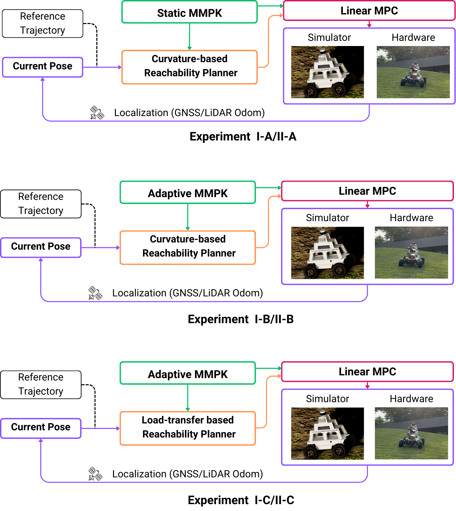
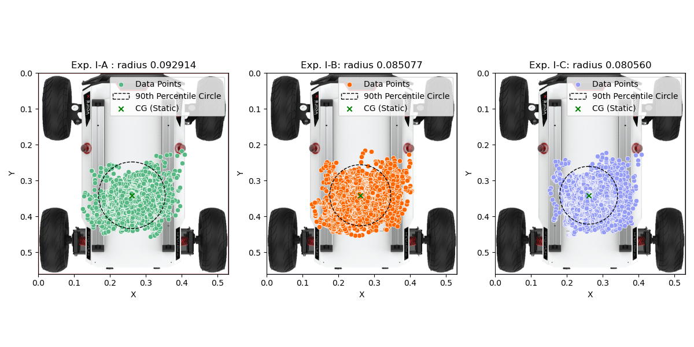

# Modeling and Control of Off-road Autonomous Vehicles with Situationally Aware Data-Driven Framework (Results Documentation)
This repository serves as a supplemental documentation for capturing the framework, 
experimental setup and results for 
Static and Adaptive Multi-Model Parameterized Koopman framework.

## Table of Contents
- [Abstract](#abstract)
- [Repo Organization](#repository-organization)
- [MMPK Framework](#mmpk-framework)
- [Experimental Setup](#experiment-setup)
- [Results](#results)
- [Contact](#contact)


### Abstract:
In recent years, the scope of deployments of
Uncrewed Ground Vehicles (UGVs) has significantly expanded
from traditional onroad- and industrial- environments to in-
creasingly challenging off-road terrain. These challenging do-
mains feature non-linear wheel-terrain interactions and sig-
nificant environmental perturbations. This complicates use of
traditional model-based control paradigms - accurate models
can be both challenging to derive and may not fully capture
real-world complexities. In this regard, learning-based tech-
niques leveraging neural-networks are often used to capture
complex dynamics but often at the cost of explainability and
generalizability. This study presents an alternate viewpoint
to capture the complex vehicle dynamics in unstructured
environments through a data-driven learning-based approach
but without the mentioned sacrifices. This is achieved by a novel
End-2-End framework utilizing the Koopman operator theory.
Our framework captures the dynamics in a multi-model setting
with an auxiliary control matrix to factor in environmental
perturbations. Additionally, we propose an outer control loop
incorporating a novel model-driven kinodynamic motion plan-
ner and path-tracking controller. Our approach is computation-
ally efficient, robust and generalizable for effectively realizing
offroad path tracking problems. This work advances the data-
driven modeling- planning- and controls approach for offroad
operations, laying the groundwork enabling next-generation
UGVs to expand their operating domains even further.

**Paper (Preprint)**: </br>
Coming Soon!


### Repository Organization
- **Figures:** This folder contains all the plots from the experiment. 
- **Videos:** Folder for storing video results from MMPK hardware deployment.

### MMPK Framework


The framework can be broken down into following process flows.</br>

- **Data-gathering/Model-training (Offline):** 
  - First, we collect data of a vehicle undergoing maneuvers resulting in roll/yaw plane excitation.
  - The data is then converted into body-frame representation.
  - Finally, the data is parameterized into discrete bins according to curvature.
  
- **Parameterized family of Koopman models (Offline):** 
  - In a nutshell, the MMPK approach generates model for each of the discrete curvature bin to capture dynamics across the entire operating domain.
  - We present two types of modeling techniques based on MMPK approach (more info on fundamental foundation can be found [here](https://www.researchgate.net/publication/380152547_Expanding_Autonomous_Ground_Vehicle_Navigation_Capabilities_through_a_Multi-Model_Parameterized_Koopman_Framework)).
     - Static MMPK: Modeling without consideration of effects of offroad terrain leading to load-transfers.
     - Adaptive MMPK: Considers and rejects terrain disturbances with the help of an augmented control matrix.
  
- **Outer control loop (Online):** 
  - For the online real-time deployment, the reference trajectory and the pose estimate of the vehicle are sent to the local motion planner.
  - The local planner samples all the feasible trajectories across models and chooses the one closest to the reference trajectory.
  - Similar to modeling techniques, there are two novel kinodynamic motion planners presented here.
    - Curvature-based Reachability Planner: For each of the model, this planner generates a trajectory satisfying the respective curvature constraint.
    - Load-transfer based Reachability Planner: For each of the model, this planner not only generates a trajectory to satisfy the curvature constraint, but also considers the dynamic load transfers due to terrain perturbations to predict pose evolution across the prediction horizon.
  - This reference trajectory along with the selected curvature is passed forward to the linear MPC.
  - The linear MPC produces high-level commands (velocity steering) for the vehicle.


### Experiment Setup
The following diagram presents pictorial representation for host of experimental stipulations for thorough
validation of MMPK framework in simulation and hardware deployment settings.



The experiments are divided into two main sections: Experiment I for simulation-based deployment and Experiment II for hardware deployment, as illustrated above. Each experiment considers a modeling approach (Static or Adaptive MMPK), planning strategy (Curvature-based or Load-Transfer based Reachability Planner), along with a linear MPC considering the chosen model set. The experimental setup includes the following stipulations:


**Experiment I-A/II-A:**<br>
Static MMPK with Curvature-based Reachability Planner. 
Here the modeling, planning and control do not account for adapting to environmental perturbations.


**Experiment I-B/II-B:** <br> 
Adaptive MMPK with Curvature-based Reachability Planner. In this case, the model and subsequent controller adapt to changing terrain. However, similar to Experiment (I-A, I-B), the motion planner simply generates trajectories to satisfy curvature requirements.


**Experiment I-C/II-C:** <br>
Adaptive MMPK with Load-transfer based Reachability Planner. Finally, all the modalities consider the effect of terrain perturbations. The modeling and control is adaptive as well as the motion planner, which generates trajectories based on dynamically evolving operating conditions.


### Results
**Simulation deployment (Experiment I-A to I-C) Box plot:**


**Simulation deployment (Experiment I-A to I-C) CG distribution:**


**Hardware deployment (Experiment II-A to II-D) Box plot:**


**Hardware deployment (Experiment II-A to II-D) Tracking Performance:**


**Hardware deployment videos** <br>

***Experiment II-A:*** <br>


| [](https://youtu.be/TAX-1FG5c20) |<video src="./Videos/Exp II-A/Run1.mp4" width="320" height="240" controls></video>     |
|------------------------------------------------------------------------------------------------------------------------------------------------------------------------------------------------------------------|-----|
| <video src="./Videos/Exp II-A/Run1.mp4" width="320" height="240" controls></video>                                                                                                                               | <video src="./Videos/Exp II-A/Run1.mp4" width="320" height="240" controls></video>    |


## Contact
Ajinkya Joglekar
- [Email](mailto:ajoglek@clemson.edu) 📧
- [LinkedIn](https://www.linkedin.com/in/ajinkyajoglekar/) 🔗


[//]: # ()
[//]: # (```bibtex)

[//]: # ()
[//]: # ()
[//]: # (@article{AutoDRIVE-Ecosystem-2023,)

[//]: # (author = {Samak, Tanmay and Samak, Chinmay and Kandhasamy, Sivanathan and Krovi, Venkat and Xie, Ming},)

[//]: # (title = {AutoDRIVE: A Comprehensive, Flexible and Integrated Digital Twin Ecosystem for Autonomous Driving Research &amp; Education},)

[//]: # (journal = {Robotics},)

[//]: # (volume = {12},)

[//]: # (year = {2023},)

[//]: # (number = {3},)

[//]: # (article-number = {77},)

[//]: # (url = {https://www.mdpi.com/2218-6581/12/3/77},)

[//]: # (issn = {2218-6581},)

[//]: # (doi = {10.3390/robotics12030077})

[//]: # (})

[//]: # (```)